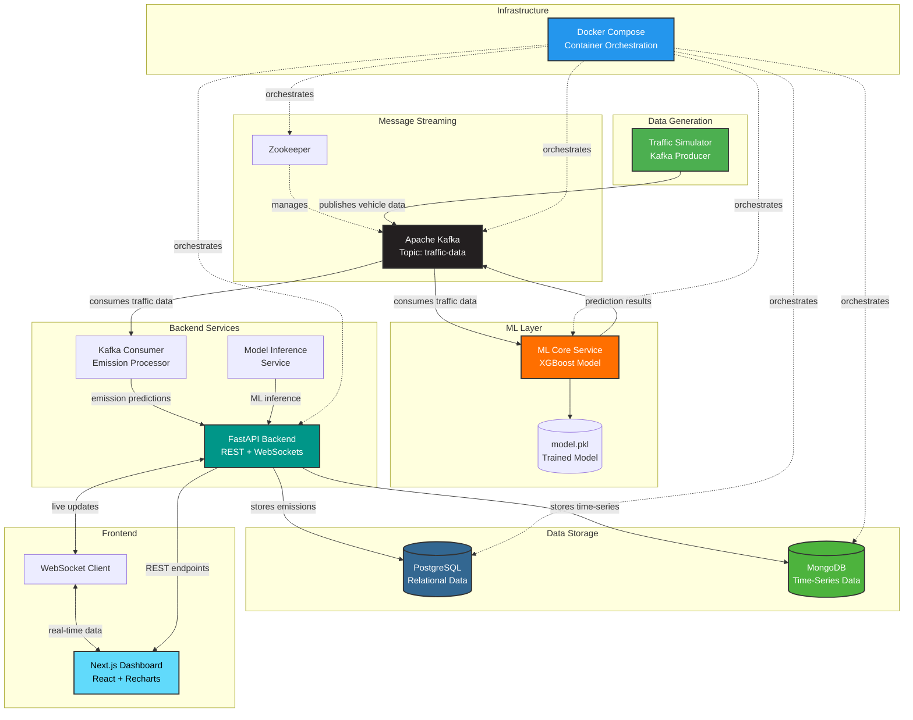

# AI-Powered Carbon Emission Tracker

A real-time intelligent system that streams transportation data, predicts carbon emissions using ML, and visualizes trends on a live dashboard.

## 🏗 System Architecture



### Component Overview

1.  **Traffic Simulator (Kafka Producer)**: Generates real-time vehicle flow, speed, and weather data and publishes to Kafka.
2.  **ML Streaming Service**: Consumes traffic data from Kafka, runs XGBoost model for CO₂ emission predictions, and publishes results back.
3.  **Backend API (FastAPI)**: Orchestrates data flow, serves REST endpoints, manages WebSocket connections for live updates, and persists data to databases.
4.  **Frontend Dashboard (Next.js)**: Displays real-time emission metrics and historical trends using Recharts visualization library.

## 🚀 Quick Start

### Prerequisites
*   Docker & Docker Compose
*   Node.js (for frontend local dev)

### 1. Start Infrastructure & Services
Run the entire stack (Kafka, DBs, Backend, ML Service) with Docker Compose:

```bash
cd infra
docker-compose up --build
```
*Wait for a few minutes for Kafka and Zookeeper to stabilize.*

### 2. Run Traffic Simulation
The traffic generator is a script. You can run it locally (if python/kafka installed) or inside a container.
Easier: Run it from the `ml_core` container or a temporary one.

```bash
# In a new terminal
docker exec -it ml_core python /app/infra/kafka_producer.py
```
*(Note: You might need to copy kafka_producer.py to ml_core context or mount it. Alternatively, install `kafka-python` locally and run `python infra/kafka_producer.py`)*

### 3. Run Frontend
```bash
cd frontend
npm install
npm run dev
```

### 4. Access
*   **Dashboard**: [http://localhost:3000](http://localhost:3000)
*   **API Docs**: [http://localhost:8000/docs](http://localhost:8000/docs)

## 📂 Folder Structure

*   `infra/`: Docker Compose & Infrastructure setup.
*   `backend/`: FastAPI application & Kafka Consumers.
*   `ml_core/`: Machine Learning training & real-time inference service.
*   `frontend/`: Next.js Dashboard.

## 🛠 Features

*   **Real-time Streaming**: End-to-end flow from data gen to UI update (<1s latency).
*   **ML Integration**: XGBoost model predicting CO₂ based on vehicle count, speed, weather.
*   **Interactive UI**: Live charts and status monitoring.
